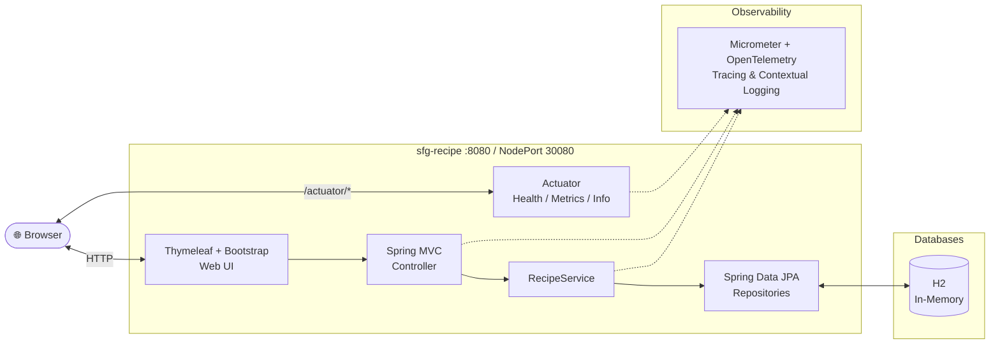

# Spring Boot Recipe Application

This application is a Spring Boot-based recipe management system. It includes a web interface accessible at `localhost:8080`, built using Bootstrap for styling and Thymeleaf for server-side templating. The application uses an H2 in-memory database to store and retrieve recipe data.

## Features

- Web interface accessible at `http://localhost:8080` or `http://localhost:30080`
- Responsive design using Bootstrap
- Server-side rendering with Thymeleaf
- Data persistence using H2 in-memory database

## Architecture Overview



## Sandbox (local dev environment)

The sandbox is provisioned by the [opencode-sandbox-kit](https://github.com/dboeckli/opencode-sandbox-kit)
and runs as a Docker container (MicroVM). It mounts this repo, starts the agent, and connects the
IntelliJ MCP server.

### Start the sandbox (OpenCode)

```powershell
sbx run opencode `
    --kit "git+https://github.com/dboeckli/opencode-sandbox-kit.git#dir=opencode-agent" `
    --template docker/sandbox-templates:opencode-docker-0.5.0 `
    --no-share-skills `
    --static-mcp idea `
    . `
    "$env:USERPROFILE\.kube:ro" `
    "C:\development\maven-repo:ro"
```

Claude Code:

```powershell
sbx run claude `
    --kit "git+https://github.com/dboeckli/opencode-sandbox-kit.git#dir=opencode-agent" `
    --template docker/sandbox-templates:claude-code-docker-0.5.0 `
    --no-share-skills `
    --static-mcp idea `
    . `
    "$env:USERPROFILE\.kube:ro" `
    "C:\development\maven-repo:ro"
```

Mammouth Code:

```powershell
sbx run "git+https://github.com/dboeckli/opencode-sandbox-kit.git#dir=mammouth-agent" `
    --no-share-skills `
    --static-mcp idea `
    . `
    "$env:USERPROFILE\.kube:ro" `
    "C:\development\maven-repo:ro"
```

- `"$env:USERPROFILE\.kube:ro"` — optional Kubernetes support (kubectl/helm in the Docker Desktop cluster)
- `"C:\development\maven-repo:ro"` — read-only host Maven cache (avoids re-downloading cached dependencies)

### Sandbox quirk

The sandbox mounts the repo via filesystem passthrough, which blocks symlinks — Spotless's
`npm install` (prettier) fails with `EPERM` unless npm skips bin links. The kit sets
`npm_config_bin_links=false` globally, so no manual export is needed inside the kit sandbox. On a
normal host (Windows/CI) this does not apply.

## Build project

During `./mvnw install` a Docker image is built locally (it is **not** pushed to a registry).
Its name is `local/sfg-recipe:<chart-version>` (e.g. `local/sfg-recipe:0.0.1-snapshot.<git-sha>`)
with the additional tag `local/sfg-recipe:development`.

### Deployment with Helm

Be aware that we are using a different namespace here (not default).

To run maven filtering for destination target/helm

```bash
./mvnw clean install -DskipTests
```

Go to the directory where the tgz file has been created after 'mvn install'

```powershell
cd target/helm/repo
```

unpack

```powershell
$file = Get-ChildItem -Filter sfg-recipe-chart-*.tgz | Select-Object -First 1
tar -xvf $file.Name
```

install

```powershell
$APPLICATION_NAME = "sfg-recipe"
$CHART_DIR = "$APPLICATION_NAME-chart"
helm upgrade --install $APPLICATION_NAME ./$CHART_DIR --namespace sfg-recipe --create-namespace --wait --timeout 8m --debug --render-subchart-notes
```

show logs

```powershell
kubectl get pods -l app.kubernetes.io/name=$APPLICATION_NAME -n sfg-recipe
```

replace $POD with pods from the command above

```powershell
kubectl logs $POD -n sfg-recipe --all-containers
```

test

```powershell
helm test $APPLICATION_NAME --namespace sfg-recipe --logs
```

uninstall

```powershell
helm uninstall $APPLICATION_NAME --namespace sfg-recipe
```

delete all

```powershell
kubectl delete all --all -n sfg-recipe
```

create busybox sidecar

```powershell
kubectl run busybox-test --rm -it --image=busybox:1.36 --namespace=sfg-recipe --command -- sh
```

You can use the actuator REST call to verify the deployment via the NodePort 30080:

```powershell
curl http://localhost:30080/actuator/health
```

Ready-made requests for all actuator endpoints are in `httpRequests/actuator.http` (use the `k8s`
environment, port 30080).

